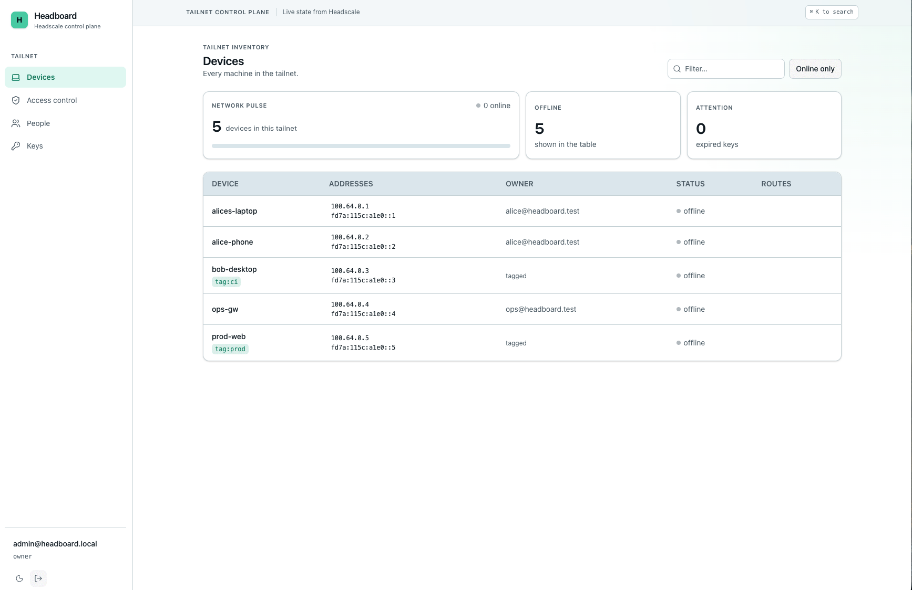
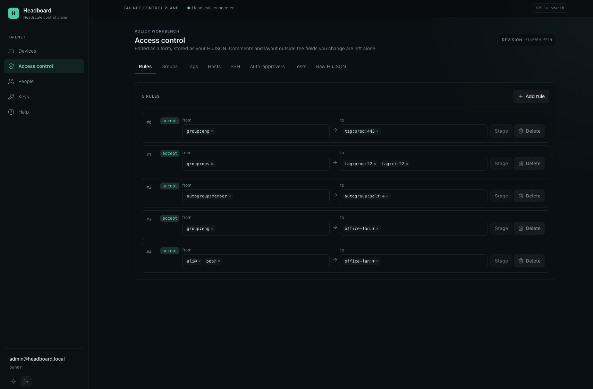

# Headboard

A web control plane for [Headscale](https://headscale.net) — a modern UI with a real ACL
editor, logins for *every* user rather than one shared admin, and a self-service portal where
people can see their own devices and the rules that actually apply to them.

Runs as a single container against your existing Headscale. No database server, and no identity
provider unless you want one.


## The idea

Headscale's policy engine is an importable Go package. Headboard reads policy, users and nodes
over the Headscale REST API, feeds them to Headscale's own `PolicyManager`, and reads the answers
back:

| Question | Answered by |
| --- | --- |
| Who can reach this device? | `FilterForNode(node)` |
| What can this device reach? | `FilterForNode` over `BuildPeerMap` peers |
| Which peers does it see? | `BuildPeerMap(nodes)` |
| Can A reach B on port N? | the destination's own filter, ports checked against `DstPorts` |
| Does the policy still hold? | its own `tests` / `sshTests` blocks |

Nothing about ACL semantics is re-implemented, so alias expansion, `autogroup:self`, tag
resolution and rule reduction stay correct on the day Headscale changes them.

**The trade:** Headboard is compiled against one Headscale version (`v0.29.3`). Upgrade the server
and the `go.mod` pin together.

## Screenshots

### Tailnet dashboard



### Access-control workbench



## Requirements

- Headscale **v0.29.x** with `policy.mode = database` (ACL writes over the API need it)
- An admin API key: `headscale apikeys create --expiration 90d`
- Docker, or Go 1.26 + Node 22 + pnpm to build from source

Nothing else. Headboard's own store is a SQLite file, and it creates its first administrator
itself — an identity provider is optional and can be added later.

## Deploy

Headboard needs an existing, reachable Headscale REST API and one of its admin API keys. It does
not start, configure, or replace Headscale. `HEADSCALE_URL` is the **Headscale server base URL**:
Headboard calls `<HEADSCALE_URL>/version` and `<HEADSCALE_URL>/api/v1/node`. Do not put the
Headboard URL, or another web UI in this variable — an HTML response or a 404 means the
URL or reverse-proxy route is wrong.

### 1. Create the environment file

```sh
cp .env.example .env
```

For a normal HTTPS deployment, set these values in `.env`:

```env
HEADSCALE_URL=https://headscale.example.com
HEADSCALE_API_KEY=hskey-api-...
HEADBOARD_PUBLIC_URL=https://headboard.example.com
```

`HEADBOARD_PUBLIC_URL` is the address a browser uses. It must be the externally reachable
`https://` address in a normal deployment; the service refuses plain HTTP outside
`HEADBOARD_DEV=true`, keeping session cookies secure. If a reverse proxy serves Headboard at a
path, include it here — for example, `https://vpn.example.com/manage`.

Headscale itself may use `http://` only for an isolated local/private setup. Do not use HTTP to a
remote production server: the Headscale admin API key would travel unencrypted.

### Option A: build from this checkout

Use this when you have the source checkout and want Docker Compose to build the image locally:

```sh
docker compose -p headboard up -d --build
docker compose -p headboard logs -f headboard
```

This uses [`compose.yaml`](compose.yaml), creates the `headboard-data` volume, and publishes the
port configured in that file. To stop it later without deleting accounts, sessions, audit history,
or policy history:

```sh
docker compose -p headboard down
```

### Option B: pull a published release image

Use [`compose.release.yaml`](compose.release.yaml) when deploying a tagged release. It pulls
`ghcr.io/jemang/headboard`; choose a fixed tag rather than `latest`:

```env
# Add to .env
HEADBOARD_VERSION=0.2.0
```

Then pull and start it:

```sh
docker compose -p headboard -f compose.release.yaml pull
docker compose -p headboard -f compose.release.yaml up -d
docker compose -p headboard -f compose.release.yaml logs -f headboard
```

For a private registry package, authenticate on the deployment host before the pull:

```sh
docker login ghcr.io
```

To upgrade, change `HEADBOARD_VERSION` in `.env`, then repeat `pull` and `up -d`. Docker Compose
preserves the `headboard-data` volume, so the Headboard database survives an image upgrade.

### Option C: build a local tagged image, then run the release Compose file

This is useful for testing the release container before publishing it. Build an image with the
same name that [`compose.release.yaml`](compose.release.yaml) expects:

```sh
docker buildx build --load \
  --platform linux/arm64 \
  --build-arg VERSION=0.2.0-local \
  -t ghcr.io/jemang/headboard:0.2.0-local \
  .
```

Use `linux/amd64` on an Intel/Linux host. Add this to `.env`:

```env
HEADBOARD_VERSION=0.2.0-local
```

Start without pulling from GHCR, because the image already exists locally:

```sh
docker compose -p headboard-local -f compose.release.yaml up -d --pull never
```

### Local HTTP test only

When running Headboard locally without TLS, use the embedded UI in the release image and make the
port and public URL agree. For a `3001:3000` mapping, for example:

```env
HEADBOARD_PUBLIC_URL=http://127.0.0.1:3001
HEADBOARD_DEV=true
HEADBOARD_DEV_UI_PROXY=
```

`HEADBOARD_DEV=true` does not prevent Headboard from contacting a Headscale server. It only enables
local-development behavior, including non-secure session cookies. `HEADBOARD_DEV_UI_PROXY=` is
important in a container: without that explicit empty value, development mode tries to proxy the UI
to Vite at `127.0.0.1:5173`, which does not run inside the release image. Do not use either setting
for a public deployment.

If you change the host side of the Compose port mapping, change `HEADBOARD_PUBLIC_URL` to the same
host port. The container always listens on port `3000`; for example, `3001:3000` is reached at
`http://127.0.0.1:3001`.

### First sign-in

On the first start Headboard creates an owner account and prints its password **once**:

```
$ docker compose logs headboard
────────────────────────────────────────────────────
First run. Owner account created:
  email:    admin@headboard.local
  password: 3qow-i3wv-ufqx-hmdz-vx7v
Shown once — change it after signing in.
────────────────────────────────────────────────────
```

Open `HEADBOARD_PUBLIC_URL`, sign in with that password, and change it under *Account*.

Lost it? Start once with `HEADBOARD_ADMIN_RESET=1` and a fresh password is printed the same way.
Unset it afterwards.

> The database lives in the `headboard-data` volume. Delete it and the next start is a first run
> again: new password, empty audit log. Your tailnet is untouched — Headscale remains the source of
> truth for devices, users and the policy.

### Configuration

Everything is environment variables. The ones without a default must be set.

| Variable | Default | What it does |
| --- | --- | --- |
| `HEADSCALE_URL` | — | Base URL of your Headscale, no trailing slash |
| `HEADSCALE_API_KEY` | — | Admin key. Stays in the server process; the browser never sees it |
| `HEADSCALE_PUBLIC_URL` | `HEADSCALE_URL` | The address *devices* reach Headscale at, when it differs from the one Headboard uses. Goes into the generated `tailscale up` command |
| `DATABASE_URL` | `headboard.db` | SQLite file for Headboard's own store. The image points it at `/data/headboard.db` |
| `HEADBOARD_ADMIN_EMAIL` | `admin@headboard.local` | The owner created on first run |
| `HEADBOARD_ADMIN_RESET` | `false` | Mint and print a new owner password at startup |
| `HEADBOARD_PUBLIC_URL` | `http://127.0.0.1:3000` | Where browsers reach Headboard. Required to use `https://` outside development; the OIDC redirect is derived from it |
| `HEADBOARD_DEV` | `false` | Enables local development conveniences, including HTTP session cookies. Do not set in production |
| `HEADBOARD_DEV_UI_PROXY` | `http://127.0.0.1:5173` in development | Set to an empty value with `HEADBOARD_DEV=true` in a container to serve the embedded UI instead of proxying to Vite |
| `OIDC_ISSUER` | — | Optional. Same issuer as Headscale — see below |
| `OIDC_CLIENT_ID` / `OIDC_CLIENT_SECRET` | — | Client registered with that issuer |
| `HEADBOARD_POLL_INTERVAL` | `5s` | Headscale has no event stream; this is the staleness bound |
| `HEADBOARD_SESSION_LIFETIME` | `12h` | How long a login lasts |
| `HEADBOARD_ADDR` | `:3000` | Listen address |

### Adding an identity provider

Password sign-in keeps working after this; the two sit side by side on the login screen.

Register `<HEADBOARD_PUBLIC_URL>/auth/callback` as a redirect URI, then set `OIDC_ISSUER`,
`OIDC_CLIENT_ID` and `OIDC_CLIENT_SECRET`.

**Use the same issuer as Headscale.** Headboard matches an account to its Headscale user on
`(iss, sub)` — the pair Headscale stores as `provider_identifier`. Different issuers on the two
sides means no automatic match, and every account has to be linked by hand under *People*.

With **Authentik** that is easy to get wrong, because its issuer is per-provider by default and
shaped `https://authentik.example.com/application/o/<app-slug>/`. Two applications — one for
Headscale, one for Headboard — are two different issuers. Either point both at one provider (a
provider accepts several redirect URIs), or set both providers to the same *issuer mode* and
*subject mode*. Check those names against your Authentik version; they have moved between releases.

> **Pick `OIDC_ISSUER` once and do not change it.** An account is identified by issuer + subject,
> not by email, so changing the issuer URL signs everyone in as a *new* member account — owner
> included. The old rows remain but can no longer be reached. Recovery is
> `HEADBOARD_ADMIN_RESET=1`, which is exactly why the local owner exists.

> **A CLI-seeded Headscale user and an OIDC login are still different users, even with the same
> name.** Headscale matches a login by `provider_identifier`, not by name, and a name created with
> `headscale users create` never has one. If someone's username collides with an existing CLI-seeded
> user, Headscale's own OIDC handler creates a *second* row with that name rather than matching the
> first — Headscale allows this (its uniqueness is on name **and** `provider_identifier` together).
> Two Headscale users sharing a name makes any policy rule written as `name@` ambiguous, and
> Headscale refuses to compile the policy until it's resolved. Headboard flags the collision with a
> "duplicate name" badge in *People* — delete the stray CLI-seeded row, or rename one of them, before
> it breaks the policy.

### Roles

| Role | Can |
| --- | --- |
| `owner` | Everything, including changing roles |
| `admin` | Everything except roles |
| `network-admin` | Devices and the policy, not people or keys |
| `auditor` | Read everything, change nothing |
| `member` | Their own devices |

A member sees only machines they own — probing another device's id returns 404, not 403, so the
tailnet's shape is not leaked by the error.

### Secure admission

New OIDC accounts sign in as **pending** and cannot access Headboard until an owner or admin
approves them in *People*. This includes members: a role grants only the scope of access after the
account itself is admitted. Network admins can manage devices and routes, but cannot approve
people.

Every device must be approved through Headscale's normal registration flow. Start the device
without a pre-auth key, then give its `hskey-authreq-…` request ID to an owner, admin, or
network-admin. They approve or reject that request in *Keys*. Headboard never issues a pre-auth
key.

For an existing deployment, complete this cutover deliberately:

- Set `HEADBOARD_PUBLIC_URL=https://headboard.example.com`; production startup refuses plain HTTP
  so session cookies are always marked Secure.
- Restrict Headscale API keys, CLI access, and database access to break-glass infrastructure
  operators. Direct upstream administration can bypass Headboard's approval workflow.
- In *People*, approve only the identities that should use Headboard.
- In *Keys*, review the high-severity automatic-enrolment warning and use the second confirmation
  to revoke every active legacy pre-auth key. This changes future enrolment only; existing devices
  stay connected.

## What it does

- **ACL builder.** Rules, groups, tags, hosts, SSH, auto-approvers and tests as forms, plus the raw
  HuJSON. Edits are applied as RFC-6902 patches to the document's syntax tree, so **comments and
  layout outside the field you changed stay byte-identical**. Nothing saves without showing the
  real diff and Headscale's own validation first, and a write is refused if the document changed
  underneath you.
- **Tests.** The policy's `tests` / `sshTests` run on demand, per assertion, against the live
  tailnet or a pending change. Worth knowing: Headscale *refuses to store* a policy whose tests
  fail, so a failing assertion is a blocked save, not a warning.
- **Effective rules.** For any device: who can reach it, what it can reach, and which peers it
  sees — computed by Headscale's engine, not an approximation.
- **Simulator.** "Can A reach B on port N", answered against the destination's own filter (so
  `autogroup:self` rules count), with a link to the policy line responsible.
- **The usual admin.** Devices, routes, manual device-registration approval, Headscale API keys, and
  an audit log of every change. Users open into a drawer to rename, delete (refused while they own
  devices), and link or unlink the Headboard account that signs in as them. Creating a user by hand
  is blocked if the name collides with one that already exists.
- **Device tags.** Assign or remove `tag:` values per device, suggested from the policy's own
  `tagOwners`. One-way: Headscale will not let a tagged device go back to having an owner.

Press <kbd>⌘K</kbd> for pages and devices.

## Develop

The UI is embedded into the binary at compile time, so a source build needs the UI built first:

```sh
cd ui && pnpm install && pnpm build && cd ..
go build ./cmd/headboard
go test ./...
```

Toolchain versions are pinned in `.tool-versions`; run through `mise exec --`.

### A Headscale to develop against

Don't point the dev loop at a real tailnet — a Headscale API key is all-access,
with no read-only scope. `compose.dev.yaml` runs a throwaway instance instead:

```sh
./dev/up.sh          # start, seed users/nodes/tags/routes/policy, write dev/.env.dev
./dev/mockoidc.sh    # a dev identity provider, in its own terminal
./dev/fixtures.sh    # GET-only capture of /api/v1 responses into internal/hs/testdata/
./dev/down.sh        # destroy it, volume and all
```

`dev/up.sh` seeds three users, five nodes (one tagged, one gateway with an approved subnet route
and exit node) and a deliberately comment-heavy policy with a `tests` block, then prints an API key
into `dev/.env.dev`. That file is gitignored and worthless outside the container. Headboard's own
store is `dev/headboard.db` — delete the file to start over.
`dev/fixtures.sh` refuses to run against anything but loopback, so it cannot be aimed at production
by accident.

### Hot reload

Run the two halves separately — `HEADBOARD_DEV=true` makes the Go server proxy unmatched routes to
Vite, keeping one origin in the browser:

```sh
cd ui && pnpm dev                                          # terminal 1, :5173
env $(grep -v '^#' dev/.env.dev | xargs) go run ./cmd/headboard   # terminal 2, :3000
```

API docs are served from the running binary at `/api/docs`.

## Status

All planned milestones are implemented and exercised against a local Headscale v0.29.3, both from
source and from the release container. Not yet run against a production tailnet. See [`.doc/`](.doc/) for the plan and
[`.claude/skills/project-conventions/`](.claude/skills/project-conventions/SKILL.md) for the
gotchas worth reading before changing `internal/`.
